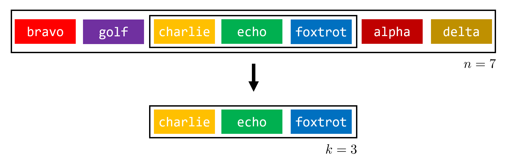

# CC1 - Sort-Of Sorted

## Introduction

*Sorting* is one of the most fundamental processes in computer science, helping us organize our data for quick
access. Later in the course, we'll explore the most popular sorting algorithms and analyze their performance
in different situations; some perform quite well when a dataset is mostly sorted but perform poorly when it
is mostly unsorted, while others perform equally well in all situations. 

To characterize *how sorted* a dataset is, we can look to see if any "chunks" of our data are already in sorted order.
If these presorted chunks are *long*, we might conclude
that our data is *mostly sorted*; if these presorted chunks are *short*, we might conclude that our data is
*mostly unsorted*. There are certainly other ways we could choose to characterize how sorted our
dataset is, but this length-of-presorted-chunks approach gives us an intuitive place to start.

In this coding challenge, you'll be writing a function which takes in a list of strings and returns a rough measure of
*how sorted* the list is by finding the longest presorted chunk.

## Challenge

#### Overview

Given a list of strings, determine the longest sublist consisting of strings in alphabetical order.
Return the length of this sublist along with the sublist itself.

More formally, given a list of *n* strings, determine the maximum *k* for which there exists a sublist of length
*k* consisting of strings in alphabetical order. Return a tuple with *k* as the first element and the sublist of
*k* strings in alphabetical order as the second element.

If multiple sublists of length *k* exist, return *any one* of the sublists. If given an empty list,
return 0 for *k* and an empty list for the sublist. Assume that two equal strings next to one another count as
being in alphabetical order.

#### Input

- A Python `list` of length *n* containing `string`s.

#### Output

- A Python `tuple` of length 2, where
    - Element `[0]` is *k*, the `int` length of the longest alphabetically-ordered sublist in the input.
    - Element `[1]` is a Python `list` containing the longest alphabetically-ordered sublist of `string`s in the input.

#### Examples

- Given `["bravo", "golf", "charlie", "echo", "foxtrot", "alpha", "delta"]` as input, 
return `(3, ["charlie", "echo", "foxtrot"])`. The longest sublist in alphabetical
order is the sublist consisting of the middle 3 elements.

- Given `["let's", "go", "state"]` as input, return `(2, ["go", "state"])`. The longest sublist in alphabetical
order is the sublist consisting of the final 2 elements.

- Given `["michigan", "state", "university"]` as input, return `(3, ["michigan", "state", "university"])`. The
longest sublist in alphabetical order is the entire list, and is of length 3.

- Given `["go", "green", "go", "white"]` as input, both `(2, ["go", "green"])` and `(2, ["go", "white"])`
are acceptable answers. The longest sublist in alphabetical order is of length 2 but is not unique, so
any alphabetically-ordered sublist of length 2 is acceptable.

- Given `["watch", "the", "points", "keep", "growing"]` as input, all of the following answers are acceptable:
`(1, ["watch"])`, `(1, ["the"])`, `(1, ["points"])`, `(1, ["keep"])`, `(1, ["growing"])`. Because the list is in
reverse-alphabetical order, the longest sublist in alphabetical order is of length 1: a single word.

- Given `["let's", "go", "go", "state"]` as input, return `(3, ["go", "go", "state"])`. 
The longest sublist in alphabetical order is the sublist consisting of the final 3 elements, as we assume that
two equal strings next to one another count as being in alphabetical order.

- Given `[]` as input (an empty list), return `(0, [])`. Vacuously, the longest sublist in alphabetical order is
an empty list of length 0.

#### Guarantees

- `0 <= k <= n <= 1000`
- the input `list` is guaranteed to contain only `string`s if it is not empty
- the input `list` will never be a `None`-type object and will never contain `None`-types inside

## Submission

#### Deliverables

Be sure to upload the following deliverables in a .zip folder to Mimir by 8:00p 
Eastern Time on Thursday, 9/10/20.

Your .zip folder can contain other files (for example, `description.md` and `tests.py`), but must include
(at least) the following:

    CC1.zip
        |— CC1/
            |— README.md        (for coding challenge feedback)
            |— __init__.py      (for proper Mimir testcase loading)
            |— solution.py      (contains your solution source code)
            
#### Grading

The following 100-point rubric will be used to determine your grade on CC1:

- Tests (95)
    - 00 - Coding Standard: __/5
    - 01 - Test Basic: __/15
    - 02 - Test Whole: __/15
    - 03 - Test Multiple: __/15
    - 04 - Test Single: __/15
    - 05 - Test Duplicates: __/15
    - 06 - Test Long: __/15
- Manual (5)
    - README.md is *completely* filled out with (1) Name, (2) Feedback, (3) Time
    to Completion and (4) Citations: __/5
        

## Tips, Tricks & Notes

- Returning tuples in Python is straightforward: to return `x` and `y` as a tuple, simply write `return x, y`.
    - Why are we requiring you to return a tuple with *k* *and* the sublist? Two reasons: 
    - (1) many of the projects later in the course will require you to return tuples, a feature unique to Python, and 
    - (2) you may find it easier to first write an algorithm which returns *k* only, then add the functionality
    of returning the sublist second.
- Don't sort the list
    - The idea is to find the longest presorted sublist in the *unsorted* original list 
- Use Python's built-in string comparison
    - Remember that you can compare `string1` and `string2` in Python just like you'd compare numbers, with
    `if string1 <= string2:`
- Python's *list slicing* syntax may come in handy
    - To extract the sublist of elements beginning at index `start` to index `end-1`, simply write `my_list[start:end]`
- As you complete this coding challenge, reflect on how run time and memory use come into play. Can you optimize
your approach to run faster and use less memory? 
    - We know you can solve the problem using two nested loops; can you solve it with a single loop?
    - In future coding challenges and projects, you'll need to adhere to *time and space complexity* constraints; 
    for this project, you simply need to construct a working solution.
- Refer to Onsay's PyCharm setup and debugging tutorial to configure your working environment; now is the best time
to get comfortable with PyCharm, as we'll be using it for the rest of the semester!
- Remember that *all challenges are opportunities*, in this course and beyond. The journey to your solution is
the true reward, so make the most of it. Enjoy!