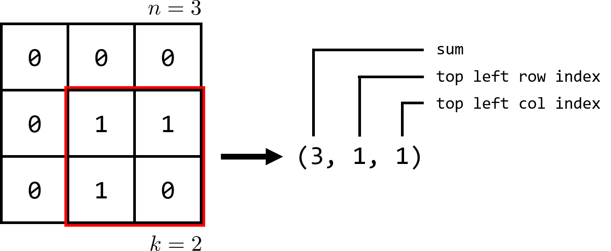

# CC2 - Drop It Like It's Hot

## Introduction

*Optimization* motivates the development of many algorithms and data structures, unifying computer science with
mathematics to answer the question: given limited resources, how can we best utilize those resources?

In business, decisions are often limited by funding; optimizing business decisions entails determining the
strategy that maximizes dollars earned per dollar spent. In manufacturing, decisions are often limited by
raw materials; optimizing processes entails maximizing output with limited input. Likewise, in medicine, decisions
are often limited by personnel; optimizing patient outcomes entails ensuring the sickest patients spend more time
with in-demand doctors than healthier ones.

The recent wildfires in California have spurred research seeking to improve firefighting strategies, providing
yet another domain for optimization: given a limited number of firefighters, airplanes and water reserves,
what is the best way to fight a wildfire?

In this coding challenge, you'll be working toward this end by writing a function which determines the optimal location
to drop water in a fire-prone region, extinguishing the greatest number of hotspots.

The fire-prone region will be represented as a square 2D list containing 0's and 1's, where 1's represent cells on fire
and 0's represent cells *not* on fire. Similarly, the area over which you may drop water is represented as a smaller
square; your goal is to place this square of limited size (drop the limited amount of water)
over the greatest number of cells containing 1's (greatest number of cells on fire).

## Challenge

#### Overview

Given a square 2D list holding only 0's and 1's, determine the greatest number of 1's that can be covered by a
square of smaller size.

More formally, given an *n x n* 2D list in `[row][col]` order holding only 0's and 1's, and an integer *k <= n*,
determine the greatest number of 1's that can be covered by a square of size *k x k*. Return a tuple with the
number of 1's this optimal *k x k* square covers as the first element, the `row` of the top left corner of this
optimal *k x k* square as the second element, and the `col` of the top left corner as the third element.

If several different *k x k* squares cover the same (maximum) number of 1's, return the `row, col` 
pair of the top left corner of the *top left* optimal placement, i.e., the placement for which `row + col` is smallest.
There will not be a case where multiple optimal placements with the same `row + col` sum exist.
If given `k=0` or an empty 2D list, return 0 for the number of 1's covered, 0 for the `row` and 0 for the `col`.

To receive full credit for your solution, you must adhere to a time complexity of *O((n^2)(k^2))*. Extra credit
is available for *O((n^2)(k))* solutions. 

#### Input

- A square 2D `list` of size *n x n* containing 0's and 1's as `int`s in row-major order, i.e., such that `list[i][j]` indexes
into the element at row `i` and column `j`
- An `int` *k*

#### Output

A Python `tuple` of length 3, where
- Element `[0]` is the greatest number of 1's that may be covered by a square of size *k x k*
- Element `[1]` is the `row` of the top left corner of the optimal placement of the *k x k* square
- Element `[2]` is the `col` of the top left corner of the optimal placement of the *k x k* square

#### Complexity

For an input 2D list of size *n x n* and an `int` *k* your solution must adhere to a time complexity of *O((n^2)(k^2))*.
Extra credit is available for *O((n^2)(k))* solutions. 

#### Examples

Given the following 2D list as input with `k=2`, return `(3, 1, 1)` as the optimal 2x2 square covers
3 1's and is placed with its top left corner in row 1, column 1.

    [[0, 0, 0],
     [0, 1, 1],
     [0, 1, 0]]
     
Given the following 2D list as input with `k=2`, return `(2, 0, 0)` as the optimal
2x2 square covers 2 1's and could be placed with its top left corner at either `(0, 0)` or `(1, 1)`, but
the placement at `(0, 0)` is the top leftmost placement, i.e., has the smallest `row + col` sum.

    [[1, 0, 0],
     [0, 1, 0],
     [0, 0, 1]]
     
Given the following 2D list as input with `k=2`, return 
`(1, 0, 0)` as the optimal 2x2 square covers a single 1 and could be placed with its top left corner at either 
`(0, 0)` or `(0, 1)` or `(1, 0)` or `(1, 1)`, but the placement at `(0, 0)` is the top leftmost placement,
i.e., has the smallest `row + col` sum.

    [[0, 0, 0],
     [0, 1, 0],
     [0, 0, 0]]
     
Given the following 2D list as input with `k=3`, return `(5, 0, 0)` as the optimally-placed 3x3 square covers
the entire 2D list with its top left corner at `(0, 0)`

    [[0, 1, 0],
     [1, 0, 1],
     [1, 1, 0]]
     
Given any 2D list as input with `k=0`, return `(0, 0, 0)` as any 0x0 square will cover 0 1's and should be placed
at `(0, 0)` for simplicity's sake.

Given an empty 2D list `[[]]` with any `k`, return `(0, 0, 0)` as there are no 1's to be covered.

#### Guarantees

- `0 <= k <= n <= 1000`
- the input 2D `list` is guaranteed to be a `list` of `list` of `int`, i.e., the input 2D list is itself a `list` object
containing `list` objects inside representing rows, each containing only 0's or 1's stored as `int`s.
- the input 2D `list` is guaranteed to be square, i.e., will satisfy `len(list) == len(list[i])` for all `0 <= i < n`
- the input 2D `list` will never be a `None`-type object and will never contain `None`-types inside
- the optimal *top left* placement with minimal `row + col` sum will be unique, i.e., there will not be
optimal solutions at (1, 2) and (2, 1).

## Submission

#### Deliverables

Be sure to upload the following deliverables in a .zip folder to Mimir by 8:00p 
Eastern Time on Thursday, 9/17/20.

Your .zip folder can contain other files (for example, `description.md` and `tests.py`), but must include
(at least) the following:

    CC2.zip
        |— CC2/
            |— README.md        (for coding challenge feedback)
            |— __init__.py      (for proper Mimir testcase loading)
            |— solution.py      (contains your solution source code)
            
#### Grading

The following 100-point rubric will be used to determine your grade on CC2:

- Tests (85)
    - 00 - Coding Standard: __/5
    - 01 - Test Basic: __/20
    - 02 - Test All/None: __/20
    - 03 - Test Multiple: __/20
    - 04 - Test Long: __/20
- Manual (15)
    - Time Complexity is *O((n^2)(k^2))*: __/10
    - README.md is *completely* filled out with (1) Name, (2) Feedback, (3) Time
    to Completion and (4) Citations: __/5
- Extra Credit (10)
    - Time Complexity is *O((n^2)(k))*: __/10
        
## Tips, Tricks & Notes

- Because you're returning the top left `row, col` index of your covering square,
you can stop your search early - when? 
    - Don't color (cover) outside the lines!
- How can you avoid repeating work when counting up the number of 1's in a *k x k* square?
    - Is there a way you can reuse information from computing the sum of overlapping *k x k* squares?
    - Although the time complexity requirement is *O((n^2)(k^2))*, there exists an *O((n^2)(k))* solution.
- Remember that *all challenges are opportunities*, in this course and beyond. The journey to your solution is
the true reward, so make the most of it. Enjoy!

