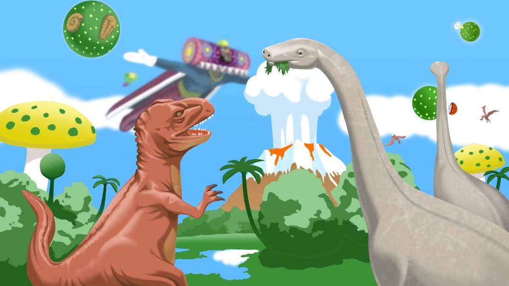
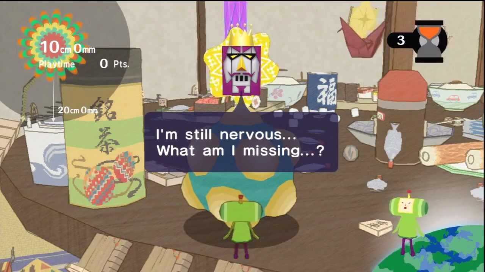
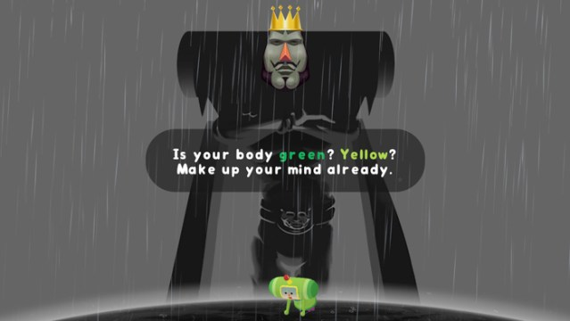

# CC7 - Lonely Rolling Star

Due: Thursday, December 3rd @ 8:00pm

This is not a team project, do not copy someone else’s work.

# Introduction

The King of All Cosmos has hit his head on a comet and destroyed all of the stars in the sky again. He’s ordered his son, The Prince, to go to earth and collect anything and everything with his Katamari to recreate all the stars and constellations. However, The King is very picky about the Katamari that The Prince creates and has to judge each one himself. The only problem is that The King is currently incapacitated and keeps referring to himself in the third person so he is in no state to be judging the Katamari. The Prince and all of his cousins decide that they need to create the RoboKing to replace The King while he is out of commission. The only problem is that they don’t know how to code the judgment behavior into the RoboKing.

While on Earth The Prince rolls you up in his Katamari. While he his rolling the Katamari around you hear him pondering over how to solve his issue. You get his attention and tell him that you can help. You being a 331 student realize that there is a data structure that you can use to solve the problem and you agree to program the RoboKing’s Katamari judgement behavior.

## Challenge
### Overview

You will design a data structure that can quickly look up the size of an item in the Katamari and will have a function that can calculate the size of the Katamari, its top three categories, and collect any cousins that may have been picked up.

Your structure should be able to load in new scoring information and store it in a way that can easily searched.

Each item in the katamari will be represented by an Item class that contains the item’s name and category.

This data structure should be defined by a class, RoboKingOfAllCosmos, and should support the functions construct_score_book, get_score_book, and judge_katamari as defined below.

The Items class and a template class declaration for the RoboKingOfAllCosmos has been provided, but all required functions need to be added. Feel free to use as many additional member functions and class attributes as you need.

##Specs
### Item

**DO NOT EDIT THIS CLASS IN ANY WAY!**

__init__(item_name, item_category)
- self.name: A string representing the item’s name
- self.category: A string representing the item’s category

### RoboKingOfAllCosmos

**construct_score_book(items_and_size)**
- Given a list of items and their associated size add them to the RoboKing’s memory to be stored for later use
items_and_size: A list of `(string, float)` tuples with the string being the item’s name and the float being the item’s size
- Return: None
- Time Complexity: **O(n)**
- Space Complexity: **O(1)**

**get_score_book()**
- Will return the contents of the current scoring container as a list of tuples with the order (string, float).
- Returns: `List[ (string, float) ]`
- Time Complexity: **O(n)**
- Space Complexity: **O(n)**

**judge_katamari(katamari_contents)**
- Given a list of items representing the Katamari’s contents evaluate it give it a size based on the items it contains and find the top 3 categories of items that the katamari contains. If a cousin is found in keep track of it.
- Note: Cousins will not contribue to the Katamari's size
- katamari_contents: A list of Items that represents the contents of the given katamari
- Returns: The katamari’s size, a list containing the top three categories of items and how many were in each categories (Ex. `[(cat1, 7), (cat2, 6), (cat3, 2)]`), and a list of any found cousins
- Time Complexity: **O(nlogn)**
- Space Complexity: **O(n)**

## Examples

Example Scoring container: `[('eyedrops', 7.3), ('long screw', 3.2), ('short screw', 2.5), ('push pin', 3.5), ('cough drop', 3.1), ('nail', 3.2)]`

A tuple will be used a represent an item, however please note that items aren’t tuples!

Empty Katamari:

Given an empty katamari `[ ]`

Expected: `(size: 0, top three: [ ], cousins: [ ])`

Katamari With No Cousins:

Given the following katamari `[(‘eyedrops’, ‘necessities’), (‘long screw’, ‘tools’), (‘short screw’, ‘tools’), (‘push pin’, ‘stationary’), (‘cough drop’, ‘necessities’), (‘nail’, ‘tools’)]`

Expected: `(size: 22.8, top three: [(‘tools’, 3), (‘necessities’, 2), (‘stationary’, 1)], cousins: [ ])`

The size is calculated by adding the size of the `eyedrops, long screw, short screw, push pin, cough drop, and nail`. So that would be `7.3 + 3.2 + 2.5 + 3.5 + 3.1 + 3.2 = 22.8`

Katamari With Cousins:

Given the following katamari `[(‘eyedrops’, ‘necessities’), (‘long screw’, ‘tools’), (‘short screw’, ‘tools’), (‘push pin’, ‘stationary’), (‘cough drop’, ‘necessities’), (‘nail’, ‘tools’), (‘The Prince’, ‘cousin’), (‘The King Of All Cosmos’, ‘cousin’)]`

Expected: `(size: 22.8, top three: [(‘tools’, 3), (‘necessities’, 2), (‘cousin’, 2)], cousins: [ ‘The Prince’, ‘The King Of All Cosmos’])`

The size is calculated by adding the size of the `eyedrops, long screw, short screw, push pin, cough drop, and nail`. So that would be `7.3 + 3.2 + 2.5 + 3.5 + 3.1 + 3.2 = 22.8`

**Note** that the size is still the same as the above example despite the fact that we add The Prince and The King to the katmari. This is becasue cousins don't add to the Katamari's size.

### Guarantees
The list given to the construct_score_container function will always be a list of tuples with the order (string, float)
The list given to the judge_katamari function will also be a list of Item objects
## Submission

### Deliverables

Be sure to upload the following deliverables in a .zip folder to Mimir by 8:00PM Eastern Time on Thursday, 12/03/2020.

Your .zip folder can contain other files (for example, `description.md` and `tests.py`), but must include (at least) the following:

CC7.zip

    |— CC7/

        |— README.md        (for coding challenge feedback)

        |— __init__.py      (for proper Mimir testcase loading)

        |— solution.py      (contains your solution source code)

## Grading
The following 100-point rubric will be used to determine your grade on CC7:

- Tests (65)
    - 00 - Coding Standard: __/5
    - 01 - Construct Score Book Basic: __/5
    - 02 - Construct Score Book Advanced: __/12
    - 03 - Judge Katamari Basic: __/14
    - 04 - Judge Katamari Advanced: __/14
    -05 - Large Random Comprehensive: __/15
-Manual (35)
    - Construct Score Book Time Complexity is O(n): __/5
    - Construct Score Book Space Complexity is O(1): __/5
    - Get Score Book Time Complexity is O(n): __/5
    - Get Score Book Space Complexity is O(n): __/5
    - Judge Katamari Time Complexity is O(nlogn): __/5
    - Judge Katamaei Book Space Complexity is O(n): __/5
    - README.md is completely filled out with (1) Name, (2) Feedback, (3) Time to Completion and (4) Citations: __/5

## Tips, Tricks, and Notes
- **You must fill out docstrings to receive Coding Standard points!**
- Additional data structures outside of Python Lists and Dictionaries and any provided data structure are not allowed
- If you’re getting tripped up by the word Katamari it’s basically just a ball that’s pushed around and picks up all items that are smaller than it.
- If you’re a little confused or curious where this idea came up from look up Katamari Damacy it’s a fantastic game from the PlayStation 2.
## Some Fun Asides
- If you’re looking to get into the Katamari mood [this](https://www.youtube.com/watch?v=2aTdAgMHOvU&feature=youtu.be) is what I listened to while making this CC and I highly recommend it if you’re looking to get inspired
- Also if you want to see something wacky I highly recommend watching the [Katamari Damacy intro](https://www.youtube.com/watch?v=M7EXlS9-XpU&feature=youtu.be)

Coding Challenge Created by Andy Wilson and Ian Barber

Coding Challenge insipred by the Katamari series